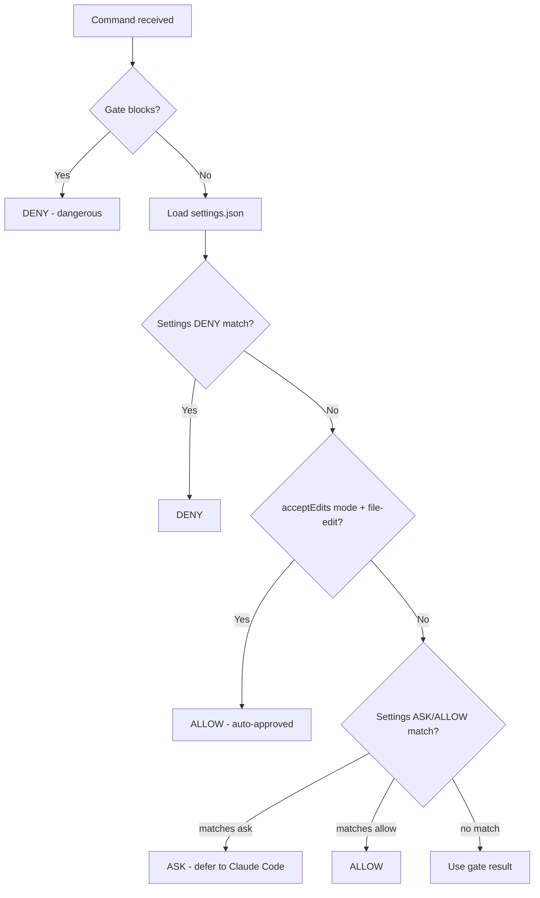

# Bash Gates - Claude Code Permission Hook (Rust)

Intelligent bash command permission gate using tree-sitter AST parsing. Auto-allows known safe operations, asks for writes and unknown commands, blocks dangerous patterns.

**Claude Code:** Use as PreToolUse + PermissionRequest + PostToolUse hooks (native integration)
**Gemini CLI:** Use `--export-toml` to generate policy rules

## Quick Reference

```bash
cargo test                              # Full test suite
cargo test gates::git -- --nocapture    # Single gate with output
cargo test test_git_status_allows       # Single test
cargo build --release                   # Static musl binary by default
cargo clippy -- -D warnings             # Lint

# Manual test
echo '{"tool_name": "Bash", "tool_input": {"command": "git status"}}' | bash-gates
```

## Hook Types

bash-gates supports three Claude Code hooks:

| Hook | Purpose | When it runs |
|------|---------|--------------|
| **PreToolUse** | Block dangerous commands, allow safe ones, provide hints, track "ask" decisions | Before any permission check |
| **PermissionRequest** | Approve safe commands for subagents | After internal checks decide to "ask" |
| **PostToolUse** | Detect successful execution, add to pending approval queue | After command completes |

**Why three hooks?**
- PreToolUse handles command safety for the main session and tracks commands that return "ask"
- PermissionRequest makes those same decisions work for subagents (where PreToolUse's `allow` is ignored)
- PostToolUse detects when "ask" commands complete successfully and queues them for permanent approval

## Project Structure

```
├── AGENTS.md        # Shared project docs (CLAUDE.md and GEMINI.md are symlinks)
├── build.rs         # Code generation: rules/*.toml -> src/generated/
├── Cargo.toml
├── .claude-plugin/  # Plugin manifest + marketplace catalog
│   ├── marketplace.json  # Marketplace discovery
│   ├── plugin.json       # Plugin manifest
│   └── README.md         # Plugin documentation
├── skills/          # Plugin skills (review, test-gate)
├── rules/           # Declarative gate definitions (13 TOML files)
│   ├── basics.toml, bash_gates.toml, beads.toml, cloud.toml, devtools.toml, ...
├── tests/fixtures/  # Test fixtures
├── lefthook.yml     # Git hooks
└── mise.toml        # Mise task runner config
```

## Architecture

```
src/
├── main.rs              # Entry point - reads stdin JSON, outputs decision, CLI commands
├── lib.rs               # Library root
├── models.rs            # Serde models (HookInput, HookOutput, Decision)
├── parser.rs            # tree-sitter-bash AST parsing -> Vec<CommandInfo>
├── router.rs            # Raw string security checks + gate routing + task expansion
├── settings.rs          # settings.json parsing and pattern matching
├── hints.rs             # Modern CLI hints (cat->bat, grep->rg, etc.)
├── tool_cache.rs        # Tool availability cache for hints
├── mise.rs              # Mise task file parsing and command extraction
├── package_json.rs      # package.json script parsing and command extraction
├── tracking.rs          # PreToolUse->PostToolUse correlation (15min TTL)
├── pending.rs           # Pending approval queue (JSONL format)
├── patterns.rs          # Pattern suggestion algorithm
├── post_tool_use.rs     # PostToolUse handler
├── permission_request.rs # PermissionRequest hook handler (subagent approval)
├── settings_writer.rs   # Write rules to Claude settings files
├── toml_export.rs       # TOML policy export for Gemini CLI
├── generated/           # Auto-generated by build.rs (DO NOT EDIT)
│   ├── mod.rs           # Module declarations
│   ├── rules.rs         # Rust gate functions from rules/*.toml
│   └── toml_policy.rs   # Gemini CLI TOML policy string
├── tui/                 # Interactive approval TUI
│   ├── mod.rs           # Module exports
│   ├── app.rs           # Application state and event loop
│   └── ui.rs            # ratatui widget rendering
└── gates/               # 13 specialized permission gates
    ├── mod.rs           # Gate registry (ordered: mcp first, basics last)
    ├── helpers.rs       # Common gate helper functions (flag extraction, etc.)
    ├── test_utils.rs    # Test utilities (cfg(test) only)
    ├── bash_gates.rs    # bash-gates CLI itself (read-only: allow, mutations: ask)
    ├── basics.rs        # Safe shell commands (echo, cat, ls, grep, etc.)
    ├── beads.rs         # Beads issue tracker CLI (bd)
    ├── mcp.rs           # MCP CLI (mcp-cli)
    ├── gh.rs            # GitHub CLI
    ├── git.rs           # Git commands
    ├── shortcut.rs      # Shortcut.com CLI (short)
    ├── cloud.rs         # AWS, gcloud, terraform, kubectl, docker, helm, pulumi, az
    ├── network.rs       # curl, wget, ssh, scp, rsync, netcat
    ├── filesystem.rs    # rm, rmdir, mv, cp, chmod, tar, zip
    ├── devtools.rs      # sd, ast-grep, yq, jq, semgrep, biome, prettier
    ├── package_managers.rs  # npm, pnpm, yarn, pip, uv, cargo, rustc, rustup, go, bun
    └── system.rs        # psql, mysql, make, sudo, systemctl, kill, crontab
```

### Build Pipeline

`build.rs` reads `rules/*.toml` and generates two files at build time:
- `src/generated/rules.rs` -- Rust functions implementing declarative gate logic
- `src/generated/toml_policy.rs` -- Pre-baked Gemini CLI TOML policy string

Most gate behavior is defined in TOML; custom handlers in Rust cover cases TOML can't express.

## How It Works

### PreToolUse Flow

1. **Input**: JSON from Claude Code's PreToolUse hook (includes `cwd`, `permission_mode`, `tool_use_id`)
2. **Mise expansion**: If command is `mise run <task>` or `mise <task>`, expand to underlying commands
3. **Package.json expansion**: If command is `npm run <script>`, `pnpm run <script>`, etc., expand to underlying command
4. **Gate analysis**: Security checks (raw string patterns) + tree-sitter parsing + gate checks; strictest decision wins
5. **If blocked**: Deny immediately (dangerous commands always blocked, regardless of settings)
6. **Load settings**: Merge settings.json from all locations
7. **Settings deny**: If command matches deny rules, deny immediately
8. **Accept Edits Mode**: If `permission_mode` is `acceptEdits` and command is file-editing within allowed directories, auto-allow
9. **Settings ask/allow**: Check remaining settings.json rules
10. **Hints**: For allowed commands, check if modern alternatives exist and add to `additionalContext`
11. **Track "ask" decisions**: If returning "ask", track command with `tool_use_id` for PostToolUse correlation
12. **Output**: JSON with `permissionDecision` (allow/ask/deny) and optional `additionalContext` (hints + approval instructions)

### PermissionRequest Flow

Runs when Claude Code's internal checks decide to show a permission prompt. Critical for **subagents**, where PreToolUse's `allow` is ignored.

1. Re-check the command with our gates (same logic as PreToolUse)
2. If allowed by gates -> return `allow` with optional `updatedPermissions` to add blocked path to session
3. If blocked by gates -> return `deny` with reason
4. If ask by gates -> return nothing (let normal prompt show)

Input fields: `tool_input`, `decision_reason` (optional), `blocked_path` (optional), `agent_id` (present for subagents).

### PostToolUse Flow

Runs after a command completes. Detects successful execution and queues for permanent approval.

1. Check if `tool_use_id` was tracked as an "ask" decision from PreToolUse
2. If tracked and exit code is 0 -> append to `~/.cache/bash-gates/pending.jsonl`
3. Output is silent (empty) to avoid cluttering Claude's context

## Decision Priority

```
BLOCK > ASK > ALLOW > SKIP
```

| Decision | Output | Effect |
|----------|--------|--------|
| `block` | `permissionDecision: "deny"` | Block with reason |
| `ask` | `permissionDecision: "ask"` | Prompt user for approval |
| `allow` | `permissionDecision: "allow"` | Auto-approve |
| `skip` | (triggers ask) | Gate doesn't handle command -> unknown |

**Unknown commands require approval.** If no gate explicitly allows a command, it's treated as unknown and requires user approval. For compound commands (`&&`, `||`, `|`, `;`), the strictest decision wins.

## Settings.json Integration

Gate blocks take priority over settings.json. The full precedence:



**Hook vs settings.json**: Hook returning `allow` or `deny` bypasses settings.json entirely. Hook returning `ask` defers to settings.json. Gate blocks always win -- `rm -rf /` is denied regardless of settings.

### Settings Pattern Formats

| Pattern | Type | Matches |
|---------|------|---------|
| `Bash(git:*)` | Word-boundary prefix (`:`) | `git`, `git status`, `git push` -- but NOT `github` |
| `Bash(cat /dev/zero*)` | Glob prefix | `cat /dev/zero`, `cat /dev/zero \| head` |
| `Bash(pwd)` | Exact | Only `pwd` |

The `:` word-boundary prefix is the most common. It splits on spaces and matches the command as a distinct word.

### Accept Edits Mode

When `permission_mode` is `acceptEdits`, file-editing commands are auto-allowed if:
1. The command is a known file-editing program (formatters, linters, text replacement -- defined via `accept_edits_auto_allow = true` in TOML rules)
2. The target files are within allowed directories (cwd + `additionalDirectories` from settings.json)
3. The target files are not sensitive system paths or credentials

Non-file-editing commands (package managers, git, network) still require approval even in acceptEdits mode.

## Security Checks

Before AST parsing, `router.rs` runs raw string checks on the command (after stripping comments). These catch patterns like pipe-to-shell (`| bash`), `eval`, `source`, `xargs rm`, destructive `find`/`fd`, dangerous command substitution, semicolon injection, and output redirection. See `check_raw_string_patterns()` in `router.rs` for the full list.

## Gate Rules

Gate rules are defined declaratively in `rules/*.toml`. Each rule has a `reason` field explaining why it asks/blocks. Read the TOML files for complete coverage -- they are the source of truth.

### Hints

When allowed commands use legacy tools (cat, grep, find, etc.), bash-gates adds hints suggesting modern alternatives (bat, rg, fd) via `additionalContext` -- only if the modern tool is installed (checked via `tool_cache.rs`, 7-day TTL at `~/.cache/bash-gates/available-tools.json`). Hint definitions are in `hints.rs`.

### Task Expansion

**Mise**: `mise run <task>` expands to underlying commands from `.mise.toml`/`mise.toml`, recursively including `depends` tasks and handling `dir`. Built-in mise subcommands (`install`, `use`, etc.) are not expanded.

**Package.json**: `npm run <script>`, `pnpm run <script>`, `yarn <script>` expand to the script's command from `package.json`. Shorthands like `pnpm lint` -> `pnpm run lint` are supported.

Both pass expanded commands through the gate engine; strictest decision wins.

## Adding a Tool to an Existing Gate

For most tools, just edit the TOML and rebuild -- no Rust changes needed.

**Example: Adding shellcheck to devtools**

```toml
# rules/devtools.toml
[[programs]]
name = "shellcheck"
unknown_action = "allow"  # Always safe (read-only)
```

Then `cargo build --release`. Done.

**Example: Tool with flag-conditional behavior**

```toml
# rules/devtools.toml
[[programs]]
name = "prettier"
unknown_action = "allow"

[[programs.ask]]
reason = "Writing formatted files"
if_flags_any = ["--write", "-w"]
```

**Available TOML options:**

| Field | Description |
|-------|-------------|
| `name` | Program name |
| `aliases` | Alternative names (e.g., `["podman"]` for docker) |
| `unknown_action` | What to do for unknown subcommands: `allow`, `ask`, `skip`, `block` |
| `[[programs.allow]]` | Rules that allow (with optional conditions) |
| `[[programs.ask]]` | Rules that ask (requires `reason`) |
| `[[programs.block]]` | Rules that block (requires `reason`) |

**Rule conditions:**

| Field | Description |
|-------|-------------|
| `subcommand` | Match specific subcommand (e.g., `"pr list"`) |
| `subcommand_prefix` | Match subcommand prefix (e.g., `"describe"` matches `describe-instances`) |
| `if_flags_any` | Ask/allow only if any of these flags present |
| `unless_flags` | Allow unless any of these flags present |
| `if_args_contain` | Block if args contain these values |
| `accept_edits_auto_allow` | On `[[programs.ask]]`: auto-allow this program in acceptEdits mode |

**Custom handlers:** If a tool needs complex logic beyond TOML, add to `[[custom_handlers]]`:

```toml
[[custom_handlers]]
program = "ruff"
handler = "check_ruff"
description = "ruff format asks unless --check or --diff present"
```

Then implement `check_ruff` in the gate file. The generated gate returns `Skip` for this program, letting the custom handler take over.

## Adding a New Gate

For a new category of tools (not fitting existing gates):

1. Create `rules/newgate.toml` (`priority` controls gate ordering -- lower runs first, `basics` at 100 is always last):

```toml
[meta]
name = "newgate"
description = "New category of tools"
priority = 50

[[programs]]
name = "newtool"
unknown_action = "ask"

[[programs.allow]]
subcommand = "list"

[[programs.ask]]
subcommand = "create"
reason = "Creating resource"
```

2. Create `src/gates/newgate.rs` (uses generated gate function):

```rust
use crate::generated::rules::check_newgate_gate;
use crate::models::{CommandInfo, GateResult};

pub fn check_newgate(cmd: &CommandInfo) -> GateResult {
    check_newgate_gate(cmd)
}

#[cfg(test)]
mod tests {
    use super::*;
    use crate::gates::test_utils::cmd;
    use crate::models::Decision;

    #[test]
    fn test_newtool_list_allows() {
        let result = check_newgate(&cmd("newtool", &["list"]));
        assert_eq!(result.decision, Decision::Allow);
    }

    #[test]
    fn test_newtool_create_asks() {
        let result = check_newgate(&cmd("newtool", &["create"]));
        assert_eq!(result.decision, Decision::Ask);
    }
}
```

3. Register in `gates/mod.rs`:

```rust
mod newgate;
pub use newgate::check_newgate;

pub static GATES: &[(&str, GateCheckFn)] = &[
    // ... other gates ...
    ("newgate", check_newgate),
    ("basics", check_basics), // basics should be last
];
```

## Key Patterns

### CommandInfo Fields
```rust
cmd.program        // "gh", "aws", "kubectl"
cmd.args           // vec!["pr", "list", "--author", "@me"]
cmd.raw            // Original command string
```

### Gate Return Values
```rust
GateResult::skip()           // Gate doesn't handle this command
GateResult::allow()          // Read-only, explicitly safe
GateResult::ask("Description") // Mutation, needs approval
GateResult::block("Explanation") // Dangerous, never allow
```

## Testing

```bash
cargo test                              # Full test suite
cargo test -- --nocapture               # With output
cargo test gates::git                   # Single gate file
cargo test test_git_status_allows       # Single test
cargo test -- --ignored                 # Slow tests only
```

### Test Rules

- **CI portability**: Tests must not assume specific CLI tools (rg, bat, fd, etc.) are installed. CI runners have a minimal environment. If a test depends on tool availability, detect it at runtime and skip gracefully.
- **Serde output verification**: Any struct or enum serialized to JSON for Claude Code must have a test asserting the exact field casing. The CLI expects camelCase (`updatedPermissions`, `hookEventName`). Use `serde_json::to_string` and assert key names to catch `rename_all` omissions.

## Runtime Files

All under `~/.cache/bash-gates/`:

| File | Purpose |
|------|---------|
| `tracking.json` | PreToolUse->PostToolUse correlation (15min TTL, auto-cleaned) |
| `pending.jsonl` | Approval queue -- commands awaiting `bash-gates review` |
| `available-tools.json` | Tool cache for hints (7-day TTL) |

## Gotchas

- **Never edit `src/generated/`** -- files are overwritten by `build.rs` on every build
- **`basics` must be last** in `GATES` array (priority 100) -- it's the catch-all for safe commands
- **`reason` is required** on all `[[programs.ask]]` and `[[programs.block]]` rules -- build fails without it
- **Generated function naming**: gate named `foo` generates `check_foo_gate()` in `src/generated/rules.rs`
- **TOML + Rust wiring**: Adding a new program to `rules/*.toml` is not enough if the gate has a custom handler in `src/gates/<gate>.rs`. The Rust match statement must also route the program to the generated declarative function, or it falls through to `GateResult::skip()`. Always check both files.
- **MCP permissions** use a different pattern format in settings.json: `mcp__<server>__<tool>` (double underscores, not `Bash(...)` format)
