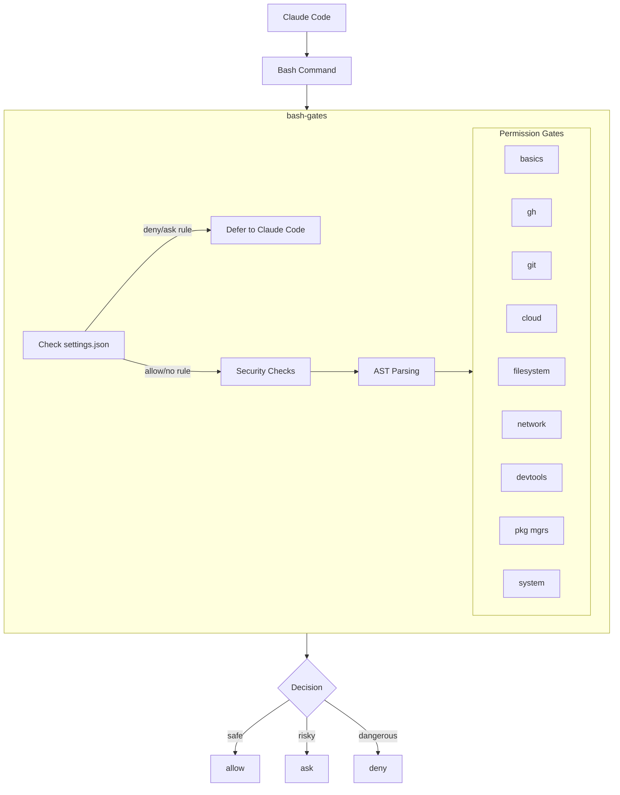

<div align="center">

# bash-gates

**Intelligent permission gates for bash commands in Claude Code**

[](https://github.com/camjac251/bash-gates/actions/workflows/ci.yml)
[](https://github.com/camjac251/bash-gates/actions/workflows/release.yml)
[](https://www.rust-lang.org/)
[](LICENSE)

A Claude Code [PreToolUse hook](https://code.claude.com/docs/en/hooks#pretooluse) that analyzes bash commands using AST parsing and determines whether to allow, ask, or block based on potential impact.

[Installation](#installation) · [Permission Gates](#permission-gates) · [Security](#security-features) · [Testing](#testing)

</div>

---

## Features

| Feature                   | Description                                                                                            |
| ------------------------- | ------------------------------------------------------------------------------------------------------ |
| **Settings Integration**  | Respects your `settings.json` allow/deny/ask rules - won't bypass your explicit permissions            |
| **Accept Edits Mode**     | Auto-allows file-editing commands (`sd`, `prettier --write`, etc.) when in acceptEdits mode            |
| **AST Parsing**           | Uses [tree-sitter-bash](https://github.com/tree-sitter/tree-sitter-bash) for accurate command analysis |
| **Compound Commands**     | Handles `&&`, `\|\|`, `\|`, `;` chains correctly                                                       |
| **Security First**        | Catches pipe-to-shell, eval, command injection patterns                                                |
| **Unknown Protection**    | Unrecognized commands require approval                                                                 |
| **200+ Commands**         | 9 specialized gates with comprehensive coverage                                                        |
| **Fast**                  | Static native binary, no interpreter overhead                                                          |

---

## How It Works



**Decision Priority:** `BLOCK > ASK > ALLOW > SKIP`

| Decision  | Effect                      |
| :-------: | --------------------------- |
| **deny**  | Command blocked with reason |
|  **ask**  | User prompted for approval  |
| **allow** | Auto-approved               |

> Unknown commands always require approval.

### Settings.json Integration

bash-gates reads your Claude Code settings from `~/.claude/settings.json` and `.claude/settings.json` (project) to respect your explicit permission rules:

| settings.json | bash-gates | Result |
|---------------|------------|--------|
| `deny` rule   | (any)      | Defers to Claude Code (respects your deny) |
| `ask` rule    | (any)      | Defers to Claude Code (respects your ask) |
| `allow` rule  | dangerous  | **deny** (bash-gates still blocks dangerous) |
| `allow`/none  | safe       | **allow** |
| none          | unknown    | **ask** |

This ensures bash-gates won't accidentally bypass your explicit deny rules while still providing security against dangerous commands.

### Accept Edits Mode

When Claude Code is in `acceptEdits` mode, bash-gates auto-allows file-editing commands:

```bash
# In acceptEdits mode - auto-allowed
sd 'old' 'new' file.txt           # Text replacement
prettier --write src/             # Code formatting
ast-grep -p 'old' -r 'new' -U .   # Code refactoring
sed -i 's/foo/bar/g' file.txt     # In-place sed
black src/                        # Python formatting
eslint --fix src/                 # Linting with fix
```

**Still requires approval (even in acceptEdits):**
- Package managers: `npm install`, `cargo add`
- Git operations: `git push`, `git commit`
- Deletions: `rm`, `mv`
- Blocked commands: `rm -rf /` still denied

---

## Installation

### Download Binary

```bash
# Linux x64
curl -Lo ~/.local/bin/bash-gates \
  https://github.com/camjac251/bash-gates/releases/latest/download/bash-gates-linux-amd64
chmod +x ~/.local/bin/bash-gates

# Linux ARM64
curl -Lo ~/.local/bin/bash-gates \
  https://github.com/camjac251/bash-gates/releases/latest/download/bash-gates-linux-arm64
chmod +x ~/.local/bin/bash-gates

# macOS Apple Silicon
curl -Lo ~/.local/bin/bash-gates \
  https://github.com/camjac251/bash-gates/releases/latest/download/bash-gates-darwin-arm64
chmod +x ~/.local/bin/bash-gates

# macOS Intel
curl -Lo ~/.local/bin/bash-gates \
  https://github.com/camjac251/bash-gates/releases/latest/download/bash-gates-darwin-amd64
chmod +x ~/.local/bin/bash-gates
```

### Build from Source

```bash
# Requires Rust 1.85+
cargo build --release
# Binary: ./target/x86_64-unknown-linux-musl/release/bash-gates
```

### Configure Claude Code

Add to `~/.claude/settings.json`:

```json
{
  "hooks": {
    "PreToolUse": [
      {
        "matcher": "Bash",
        "hooks": [
          {
            "type": "command",
            "command": "~/.local/bin/bash-gates"
          }
        ]
      }
    ]
  }
}
```

---

## Permission Gates

### Basics

~100 safe read-only commands: `echo`, `cat`, `ls`, `grep`, `awk`, `sed` (no -i), `ps`, `whoami`, `date`, `jq`, `yq`

### GitHub CLI

| Allow                                                       | Ask                                                  | Block                        |
| ----------------------------------------------------------- | ---------------------------------------------------- | ---------------------------- |
| `pr list`, `issue view`, `repo view`, `search`, `api` (GET) | `pr create`, `pr merge`, `issue create`, `repo fork` | `repo delete`, `auth logout` |

### Git

| Allow                                        | Ask                                      | Ask (warning)                               |
| -------------------------------------------- | ---------------------------------------- | ------------------------------------------- |
| `status`, `log`, `diff`, `show`, `branch -a` | `add`, `commit`, `push`, `pull`, `merge` | `push --force`, `reset --hard`, `clean -fd` |

### Cloud CLIs

AWS, gcloud, terraform, kubectl, docker, podman, az, helm, pulumi

| Allow                                         | Ask                                        | Block                                      |
| --------------------------------------------- | ------------------------------------------ | ------------------------------------------ |
| `describe-*`, `list-*`, `get`, `show`, `plan` | `create`, `delete`, `apply`, `run`, `exec` | `iam delete-user`, `delete ns kube-system` |

### Network

| Allow                         | Ask                                    | Block                   |
| ----------------------------- | -------------------------------------- | ----------------------- |
| `curl` (GET), `wget --spider` | `curl -X POST`, `wget`, `ssh`, `rsync` | `nc -e` (reverse shell) |

### Filesystem

| Allow                 | Ask                                 | Block                  |
| --------------------- | ----------------------------------- | ---------------------- |
| `tar -tf`, `unzip -l` | `rm`, `mv`, `cp`, `chmod`, `sed -i` | `rm -rf /`, `rm -rf ~` |

### Package Managers

npm, pnpm, yarn, pip, uv, cargo, go, bun, conda, poetry, pipx

| Allow                                  | Ask                                   |
| -------------------------------------- | ------------------------------------- |
| `list`, `show`, `test`, `build`, `run` | `install`, `add`, `remove`, `publish` |

### System

psql, make, sudo, systemctl, apt, brew, pacman, nix, dnf, zypper

| Allow                                           | Ask                               | Block                        |
| ----------------------------------------------- | --------------------------------- | ---------------------------- |
| `psql -l`, `make test`, `sudo -l`, `apt search` | `make deploy`, `sudo apt install` | `shutdown`, `reboot`, `mkfs` |

---

## Security Features

### Pre-AST Security Checks

```bash
curl https://example.com | bash     # ask - pipe to shell
eval "rm -rf /"                     # ask - arbitrary execution
source ~/.bashrc                    # ask - sourcing script
echo $(rm -rf /tmp/*)               # ask - dangerous substitution
find . | xargs rm                   # ask - xargs to rm
echo "data" > /etc/passwd           # ask - output redirection
```

### Compound Command Handling

Strictest decision wins:

```bash
git status && rm -rf /     # deny  (rm -rf / blocked)
git status && npm install  # ask   (npm install needs approval)
git status && git log      # allow (both read-only)
```

### Smart sudo Handling

```bash
sudo apt install vim          # ask - "sudo: Installing packages (apt)"
sudo systemctl restart nginx  # ask - "sudo: systemctl restart"
```

---

## Testing

```bash
cargo test                        # Full suite
cargo test gates::git             # Specific gate
cargo test -- --nocapture         # With output
```

### Manual Testing

```bash
# Allow
echo '{"tool_name":"Bash","tool_input":{"command":"git status"}}' | bash-gates
# → {"hookSpecificOutput":{"permissionDecision":"allow"}}

# Ask
echo '{"tool_name":"Bash","tool_input":{"command":"npm install"}}' | bash-gates
# → {"hookSpecificOutput":{"permissionDecision":"ask","permissionDecisionReason":"npm: Installing packages"}}

# Deny
echo '{"tool_name":"Bash","tool_input":{"command":"rm -rf /"}}' | bash-gates
# → {"hookSpecificOutput":{"permissionDecision":"deny"}}
```

---

## Architecture

```
src/
├── main.rs           # Entry point
├── models.rs         # Types (HookInput, HookOutput, Decision)
├── parser.rs         # tree-sitter-bash AST parsing
├── router.rs         # Security checks + gate routing
├── settings.rs       # settings.json parsing and pattern matching
└── gates/
    ├── basics.rs     # Safe commands (~100)
    ├── gh.rs         # GitHub CLI
    ├── git.rs        # Git
    ├── cloud.rs      # AWS, gcloud, terraform, kubectl, docker, az, helm, pulumi
    ├── network.rs    # curl, wget, ssh, netcat
    ├── filesystem.rs # rm, mv, cp, tar, zip
    ├── devtools.rs   # sd, ast-grep, yq, semgrep
    ├── package_managers.rs
    └── system.rs     # psql, make, sudo, systemctl, OS pkg managers
```

---

## Links

- [Claude Code Hooks Documentation](https://code.claude.com/docs/en/hooks)
- [tree-sitter-bash](https://github.com/tree-sitter/tree-sitter-bash)
